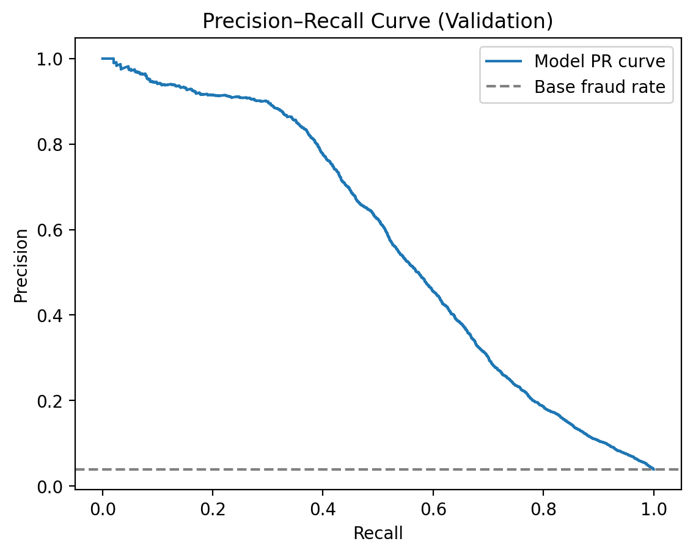
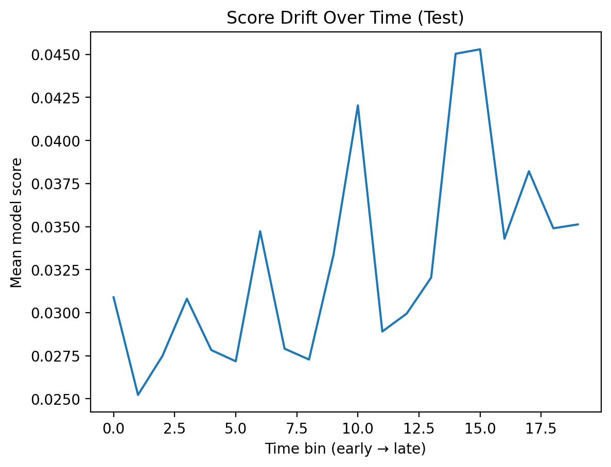
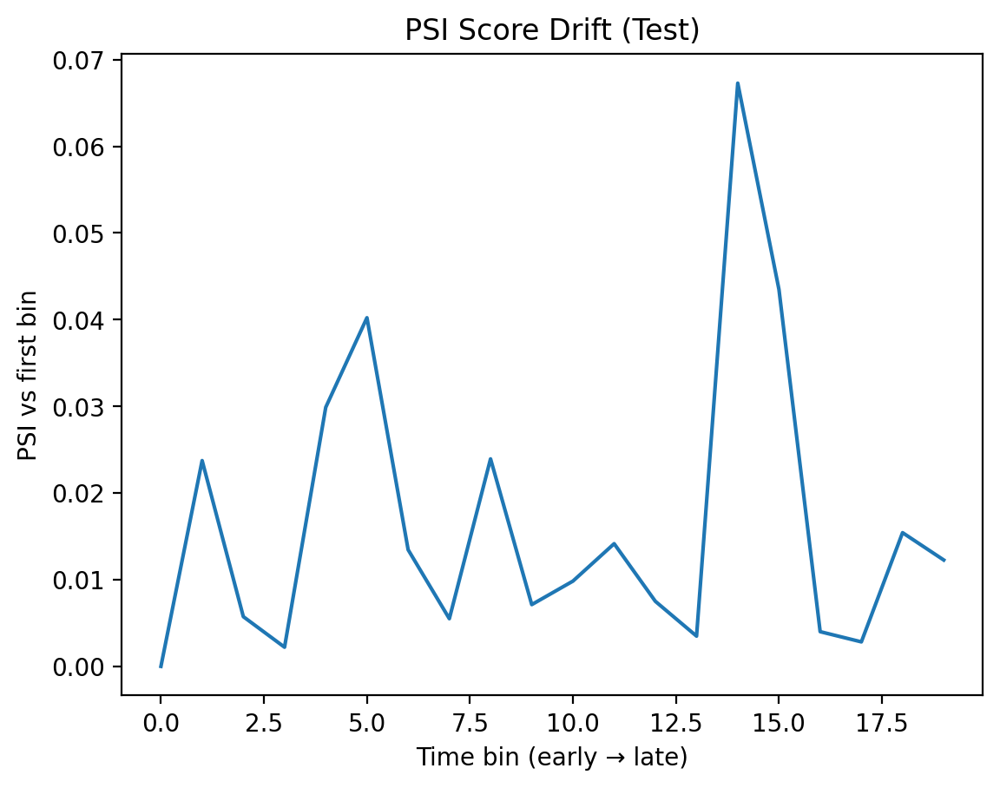

# Fraud Detection + Decisioning (IEEE-CIS)

End-to-end, industry-style fraud risk pipeline: **train → evaluate → decision policy (decline / review / step-up / approve) → monitoring (drift + PSI)**.

This project focuses on what real fraud systems do: **rank transactions by risk** and convert scores into **operational actions under capacity constraints**.

---

## Problem

Fraud is rare (~3–4%). Accuracy is misleading.

We care about:
- **PR-AUC (Average Precision):** quality under class imbalance
- **Precision@K / Recall@K:** quality of the *top alerts* given limited review capacity
- **Operational decisions:** how many we block/review/step-up, and what fraud we catch

---

## Data

- Dataset: **IEEE-CIS Fraud Detection** (Kaggle)
- Join: `train_transaction` + `train_identity` on `TransactionID` (left join)
- Split: **time-based 60/20/20** using `TransactionDT` (prevents leakage + reflects production drift)

> > ⚠️ **Data is not included in this repo** (Kaggle files are not redistributed).

### Download + place data (local)
1) Download the IEEE-CIS Fraud Detection files from Kaggle.
2) Put these CSVs under `data/raw/ieee/`:

- `train_transaction.csv`
- `train_identity.csv`
- `test_transaction.csv`
- `test_identity.csv`

Then run:

```bash
python -m src.fraud.prepare_ieee

---

## Baseline model (numeric-only)

Why baseline first: ship a strong simple model before complex encoding.

- Model: `HistGradientBoostingClassifier`
- Features: **400 numeric columns**
- Missing values: **median imputation** (fit on train, applied to valid/test)
- Primary metric: **PR-AUC (Average Precision)**

---

## Results (Validation → Test)

**Base rate**
- Validation: **3.90%**
- Test: **3.44%**

**PR-AUC**
- Validation PR-AUC: **0.572**
- Test PR-AUC: **0.462**

**Precision@K / Recall@K** (ranking performance)
- **K=1000** (review-like capacity):
  - Valid: precision **0.915**, recall **0.198**
  - Test:  precision **0.900**, recall **0.221**
- **K=10000** (review + step-up total capacity):
  - Valid: precision **0.317**, recall **0.688**
  - Test:  precision **0.243**, recall **0.598**

## Key takeaways (so what?)
- **Drift is real:** PR-AUC drops on the future test slice (0.572 → 0.462), which is expected under time-based splits.
- **Ranking still works:** Top-K precision remains strong (e.g., Precision@1000 ≈ 0.90 on test), meaning fraud is concentrated near the top of the score ranking—useful for triage.
- **Capacity is a product decision:** Increasing K trades precision for recall (K=1,000 vs 10,000). Choose K based on review/step-up capacity and the cost of false positives vs missed fraud.

---

## Decisioning policy (capacity-locked)

Instead of using a fixed probability threshold (which causes alert volume to drift),
we use **rank-based thresholds** so the queue size stays stable.

Example policy:
- Top **K_decline** → **decline**
- Next **K_review** → **review**
- Next **K_step_up** → **step-up**
- Rest → **approve**

Artifacts:
- `reports/sample_decisions_test.csv`
- `reports/sample_decisions_test_rank_policy.csv`
- `reports/metrics_summary.json`

---

## Monitoring (drift + PSI)

We generate simple monitoring artifacts you’d expect in production:

1) **Score drift over time bins** (mean score per time slice)
2) **Fraud rate drift over time bins** (label drift)
3) **PSI over time bins** (distribution shift vs first bin)

### PR Curve (Validation)


### Score drift over time (Test)


### Fraud rate over time (Test)


### PSI over time (Test)


---

## Repo structure

```text
fraud-detection-decisioning/
  README.md
  .gitignore
  data/                 # NOT tracked (put Kaggle files locally)
  notebooks/
    01_eda.ipynb
  src/
    fraud/
      prepare_ieee.py    # merge + parquet export
  reports/
    figures/
    metrics_summary.json
    psi_by_timebin_test.csv
    sample_decisions_test.csv
    sample_decisions_test_rank_policy.csv
    model_card.md
